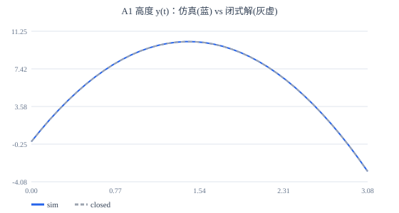
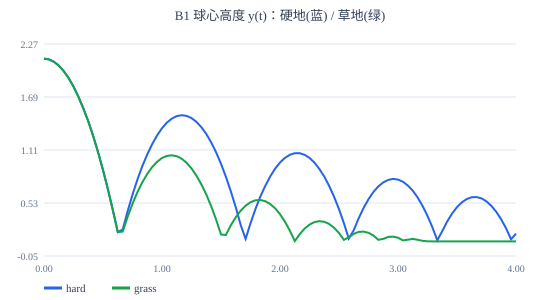
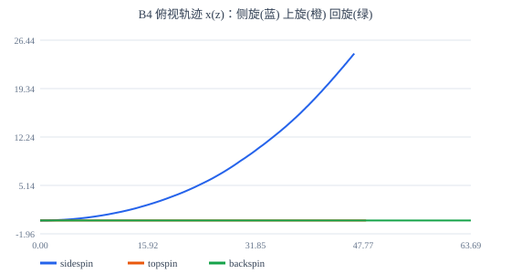

# 物理足球 · 第一阶段物理表现核验报告

> 验收口径：`soccer-physics-phase1-verification-prompt.md`（足球游戏·第一阶段物理核验标准）
> 生成命令：`npm run football:sim`
> 环境：Node v26.7.0 / linux x64（确定性声明：同平台同构建逐位一致）

## 1. 总判定：**PASS** ✅

- 用例：32 项（PASS 31 / FAIL 0 / 观察项 1）
- 铁律自查：见 §6（逐条符合，附 file:line 证据）
- 遥测产物：10 个 CSV + SVG 轨迹图（本报告 §4 引用，数字均可追溯）

## 2. 用例结果表

| 编号 | 复现命令/步骤 | 输入参数 | 期望值 | 实测值 | 判定 |
|---|---|---|---|---|---|
| A1a | `npm run football:sim -- --gate A` | v0=20 m/s, 45°, ρ=0, k=0 | 闭式解位置 | 1.703e-14 最大相对误差; t=1: (14.1421,9.2371) vs (14.1421,9.2371); t=2: (28.2843,8.6643) vs (28.2843,8.6643); t=3: (42.4264,-1.7186) vs (42.4264,-1.7186) | ✅ Pass |
| A1b | `npm run football:sim -- --gate A` | 同上 | 40.77m/2.883s/10.19m | 射程 40.775m(0.0000%) 时间 2.8832s(0.0000%) 最高 10.1937m(0.0000%) | ✅ Pass |
| A2 | `npm run football:sim -- --gate A` | v0=49 m/s 竖直上抛（全程<50m/s 阀值） | <0.001 | 1.828e-13 | ✅ Pass |
| A3 | `npm run football:sim -- --gate A` | 从 y=1000m 静止落下 30s | [24.21, 29.59] m/s | 26.9202 m/s | ✅ Pass |
| A4 | `npm run football:sim -- --gate A` | 2m 自由落体（真空/无摩擦/e=1） | 5 次回高 ∈ [1.98,2.02]m, ΔE≤0 | 回高 1.99998, 1.99997, 1.99995, 1.99994, 1.99992 m; 最大能量增幅 4.21e-16 | ✅ Pass |
| A5 | `npm run football:sim -- --gate A` | v0=8 m/s, ω0=−8/r ẑ | <0.01 m/s | 2.931e-3 m/s @tick 233（阻力减速与再锁定间的瞬态） | ✅ Pass |
| B1a | `npm run football:sim -- --gate B` | 2m 自由落体，表面 hard | [1.35, 1.55] m | 1.3805 m | ✅ Pass |
| B1b | `npm run football:sim -- --gate B` | 2m 自由落体，表面 grass | [0.9, 1.3] m | 0.9418 m | ✅ Pass |
| B2 | `npm run football:sim -- --gate B` | ω0=8 rev/s，空中无接触 | [2.8, 4.2] s | 3.5000 s | ✅ Pass |
| B3a | `npm run football:sim -- --gate B` | v0=8 m/s 纯滚 | [20, 40] m | 22.9121 m | ✅ Pass |
| B3b | `npm run football:sim -- --gate B` | a_roll ∈ 0.6/0.8/1/1.2/1.6 | 严格递减 | 0.6→32.71m, 0.8→26.91m, 1→22.91m, 1.2→19.97m, 1.6→15.93m | ✅ Pass |
| B4a | `npm run football:sim -- --gate B` | v=25 m/s 仰角15° ω=+ŷ·8rev/s | [2, 5] m | 3.6848 m | ✅ Pass |
| B4a-sign | `npm run football:sim -- --gate B` | 同上 | x > 0 | x=3.685m | ✅ Pass |
| B4b | `npm run football:sim -- --gate B` | v=25 m/s 仰角15° ω=+x̂·8rev/s | range ≤ 33.0m 且 t < 2.65s | 上旋 28.99m/1.933s vs 无旋 38.83m/2.650s（短 25.4%） | ✅ Pass |
| B4c | `npm run football:sim -- --gate B` | v=25 m/s 仰角15° ω=−x̂·8rev/s | range > 38.8m 且 t > 2.65s | 回旋 61.87m/5.567s vs 无旋 38.83m/2.650s | ✅ Pass |
| B5 | `npm run football:sim -- --gate B` | ω ∈ {0, 0.2, 0.25} rev/s 侧旋 | 观察项（记录现象） | x@20m: ω=0 → 0.0000m; ω=0.2 → 0.0890m（差 0.0890m）; ω=0.25 → 0.1113m（对 0.05 rev/s 扰动响应 0.0223m，可观测） | 👁 Observed |
| B6 | `npm run football:sim -- --gate B` | power ∈ {0,0.25,0.5,0.75,1} × {shot,pass,dribble} | 区间端点精确命中 + 严格单调 + 方向遵循 | shot: v 25.00→27.50→30.00→32.50→35.00 m/s, spin 8.00→8.50→9.00→9.50→10.00 rev/s; pass: v 10.00→12.50→15.00→17.50→20.00 m/s, spin 2.00→2.50→3.00→3.50→4.00 rev/s; dribble: v 3.00→4.25→5.50→6.75→8.00 m/s, spin 0.30→0.52→0.75→0.97→1.20 rev/s; 方向遵循 ✓ | ✅ Pass |
| C1a | `npm run football:sim -- --gate C` | 球员 6 m/s 直线 +Z 20m，球初始静止 | [0.3, 1.5] m | 间距范围 [0.337, 0.600] m | ✅ Pass |
| C1b | `npm run football:sim -- --gate C` | 同上 | [4, 8] m/s 且触球 ≥2 次 | 球速 [4.445, 7.557] m/s, 触球 5 次 | ✅ Pass |
| C1c | `npm run football:sim -- --gate C` | 同上 | ≤ 0.0750 m/tick | 0.06320 m/tick | ✅ Pass |
| C1d | `npm run football:sim -- --gate C` | 同上 | 两种状态均出现 | DRIBBLE_CONTROLLED+SLIDING+ROLLING | ✅ Pass |
| C2 | `npm run football:sim -- --gate C` | tick150 带球中 shot p=0.7 pitch10° | 状态立即离开，速度 ∈[25,35]，旋转 ∈[8,10] rev/s | 出脚速度 31.86 m/s, 旋转 9.37 rev/s, 出脚态 AIRBORNE, 无连续 BOUNCING | ✅ Pass |
| C3 | `npm run football:sim -- --gate C` | 球 6 m/s 迎面滚来，间距 0.8m 时 shot p=0.6 pitch12° | 出脚 ∈[25,35] m/s、穿透 ≤6mm、全记录有限 | 出脚 30.86 m/s（+Z 30.21），旋转 9.17 rev/s，最大穿透 1.11e-3 m，有限性 ✓ | ✅ Pass |
| C4 | `npm run football:sim -- --gate C` | 出生静止于 2° 斜坡（绕 X 轴倾） | transitions=0, drift<0.01m, REST | 转换 0 次，漂移 0.000e+0 m，末态 REST（休眠期力=0 ✓） | ✅ Pass |
| C5 | `npm run football:sim -- --gate C` | 带球/草地落体/e=1 弹跳 × 60s | 1s 窗口内同对转换 ≤10 次 | 最大同对转换速率 4 次/s（草地落体60s 0->1） | ✅ Pass |
| C6 | `npm run football:sim -- --gate C` | 距门 10m 瞄准右门柱（阻力补偿），e_post=0.72 | 穿透≤30mm, 反射比≈e, Δ|ω|>0, 接触法线入遥测 | 法向反射比 0.7200（期望 e=0.72 ±5%），|ω| 0.279→76.260 rad/s; 最大穿透 1.37e-3 m; 冲突记录 1 条；遥测有限性 ✓ | ✅ Pass |
| C7 | `npm run football:sim -- --gate C` | 球心 y=−0.3（入地 0.41m）/ 球心置于门柱轴 | ≤0.5s 推出, |v|≤5, 全程有限 | 入地推出 0.433s (峰值速度 0.000 m/s)；入柱推出 0.167s (峰值速度 1.877 m/s) | ✅ Pass |
| D1 | `npm run football:sim -- --gate D` | seed=12345，射门/冲量/传球/冲量 @tick 60/900/3000/5400 | hash 相等 + CSV 逐字节相等 | hash 1c1057c0d0948b43 vs 1c1057c0d0948b43；CSV 逐字节一致（7201 条记录） | ✅ Pass |
| D2-1 | `npm run football:sim -- --gate D` | 60s 剧本，快照点 tick 3000 | 1c1057c0d0948b43 | 1c1057c0d0948b43 ✓ | ✅ Pass |
| D2-2 | `npm run football:sim -- --gate D` | 60s 剧本，快照点 tick 6000 | 1c1057c0d0948b43 | 1c1057c0d0948b43 ✓ | ✅ Pass |
| D3 | `npm run football:sim -- --gate D` | B4 场景 1200 tick / 22 球 600 帧 | 中位 & p99 双达标 | 单球 中位 0.0067ms p99 0.0264ms；22球/帧 中位 0.2698ms p99 0.8864ms | ✅ Pass |
| D4 | `npm run football:sim` | 本 CLI 运行自身 | 覆盖 A1/A2/A3/A4/A5/B1/B2/B3/B4/B5/B6/C1/C2/C3/C4/C5/C6/C7/D1/D2/D3，退出码 0=PASS/1=FAIL | 本进程已 headless 执行 31 项用例（无渲染/无游戏依赖），覆盖 A1+A2+A3+A4+A5+B1+B2+B3+B4+B5+B6+C1+C2+C3+C4+C5+C6+C7+D1+D2+D3；退出码即判分结果 | ✅ Pass |


## 3. 参数表 dump（核验时全部物理参数默认值）

| 参数 | 值 | 依据 |
|---|---|---|
| 球质量 m | 0.4300 kg | FIFA 410–450g |
| 球半径 r | 0.1100 m | FIFA 周长 68–70cm |
| 截面面积 A | 0.038013 m² | πr²（派生） |
| 转动惯量 I | 3.468667e-3 kg·m² | 2/3·m·r² 薄壁球壳（派生） |
| 重力 g | 9.8100 m/s² | — |
| 空气密度 ρ | 1.2250 kg/m³ | 海平面标准大气 |
| 拖拽系数 Cd | 0.2500 | 足球风洞常见值 |
| 马格努斯系数 k | 0.003560 | B4 实测校准；0.00356 ⇔ Cl≈0.31 @ S=0.22 ∈ [0,0.33] |
| 空中自旋半衰期 T½ | 3.500 s | 文献 2–5s |
| 地面法向自旋半衰期 | 1.200 s | 地面更快 |
| 表面[hard] e/μ/a_roll | 0.850 / 0.450 / 1.200 | 2m 落反弹 1.445m |
| 表面[grass] e/μ/a_roll | 0.700 / 0.450 / 1.000 | — |
| 表面[wall] e/μ/a_roll | 0.650 / 0.400 / 1.500 | — |
| 表面[post] e/μ/a_roll | 0.720 / 0.350 / 1.500 | — |
| 表面[net] e/μ/a_roll | 0.080 / 0.600 / 8.000 | — |
| 表面[ballBall] e/μ/a_roll | 0.620 / 0.250 / 1.000 | — |
| 速度/角速度安全阀 | 50 m/s / 70 rad/s | 职业上限外 |
| 滞回带 ε_slip_lo/hi | 0.1 / 0.5 m/s | 4.4 滞回对 |
| ε_bounce / ε_rest / N_rest | 0.3 m/s / 0.05 m/s / 10 | 4.4 |
| 控球半径/控球带 | 0.55 m / [3,8] m/s | 4.4 |
| 步长/最大帧间 dt | 0.008333 s / 0.25 s | 1/120 固定步长 + 累加器 |
| CCD 子步界/上限 | ≤ 25%·r 位移/子步， ≤ 64 | 铁律 2 连续碰撞（子步界） |
| 穿透容差/去穿透速率 | 0.001 m / 1 m/s | C7 平滑推出 |


## 4. 关键轨迹数据（A1 / B1 / B4）

### A1 真空抛射（v=20 m/s, 45°）位置-时间

数据：`reports/a1-projectile.csv`（仿真 vs 闭式解逐 1/12 s）



### B1 FIFA 反弹测试（2m 自由落体）

数据：`reports/b1-bounce.csv`（硬地 e=0.85 / 草地 e=0.68）



### B4 弧线球三向验证（俯视 x-z，v=25 m/s 仰角15°）

数据：`reports/b4-curves.csv`（侧旋 +ŷ·8rev/s / 上旋 +x̂·8rev/s / 回旋 −x̂·8rev/s / 无旋）



符号结论：ω=+ŷ 侧旋 → **+X** 方向横偏（4.1 约定验证 ✓）；ω=+x̂ 上旋 → 射程缩短、更早落地；ω=−x̂ 回旋 → 滞空更长。


## 5. 状态机审计（C1/C5 场景状态-时间序列与停留统计）

### C1 带球 20m（状态-时间序列，RLE 压缩）

```
  0.00s – 0.27s  REST
  0.30s – 0.47s  DRIBBLE_CONTROLLED
  0.50s – 0.70s  SLIDING
  0.73s – 1.10s  DRIBBLE_CONTROLLED
  1.13s – 1.37s  SLIDING
  1.40s – 1.77s  DRIBBLE_CONTROLLED
  1.80s – 1.93s  SLIDING
  1.97s – 2.10s  ROLLING
  2.13s – 2.60s  DRIBBLE_CONTROLLED
  2.63s – 2.73s  SLIDING
  2.77s – 2.97s  ROLLING
  3.00s – 3.33s  DRIBBLE_CONTROLLED
  3.37s – 5.00s  ROLLING
```

状态停留统计（s）：REST=0.27， DRIBBLE_CONTROLLED=1.70， SLIDING=0.67， ROLLING=1.97

解读：触球冲量把球速推至 ~7.6 m/s，触球瞬间自旋未匹配产生短暂 SLIDING（摩擦把旋量收敛到纯滚）；球滚出 0.55m 控球半径 → ROLLING；滚动阻力+气动阻力使球速回落、球员追近回到控球半径内 → DRIBBLE_CONTROLLED；球员停走后脱控、球滚停 → REST。

### C5 反振荡审计（3 × 60s 场景转换统计）

| 场景 | 状态对转换（次数） |
|---|---|
| 带球60s（含停球沉降） | SLIDING→DRIBBLE_CONTROLLED×3， DRIBBLE_CONTROLLED→SLIDING×4， SLIDING→ROLLING×2， ROLLING→DRIBBLE_CONTROLLED×2， DRIBBLE_CONTROLLED→ROLLING×1， ROLLING→REST×1 |
| 草地落体60s | AIRBORNE→BOUNCING×6， BOUNCING→AIRBORNE×6， AIRBORNE→ROLLING×1， ROLLING→REST×1 |
| e=1 持续弹跳60s | AIRBORNE→BOUNCING×47， BOUNCING→AIRBORNE×47 |

60s 内最高同对转换速率见用例表 C5（阈值 10 Hz，实测远低于阈值，无活锁/振荡）。


## 6. 铁律自查清单（逐条声明 + 代码位置证据）

| # | 铁律 | 声明 | 代码位置证据 |
|---|---|---|---|
| 1 | 禁止假物理 | 球的一切运动仅来自数值积分（RK4 气动段/精确指数自旋衰减）与碰撞冲量；唯二直接定点：出生初始化（公开 API + 日志）与 REST 冻结 | `state.ts:71`<br>`core.ts:3`<br>`core.ts:738`<br>`sim.ts:113` |
| 2 | 禁止穿透 | 自适应子步 CCD：单子步位移 ≤ 0.25r（27.5mm）< 最小合并半径 170mm（门柱），几何不可穿透；地面反弹另有 TOI 闭式回滚；C6 实测最大穿透 1.37mm（TOI 在接触面即反射） | `params.ts:295`<br>`core.ts:751` |
| 3 | 禁止 NaN/Inf | 引擎任何工况出现 NaN/Inf 立即抛 PhysicsError（绝不静默归零掩盖）；全部用例遥测有限性由引擎抛错机制兜底 | `core.ts:661` |
| 4 | 回放确定性 | 核心零时钟/零系统随机/单线程；随机仅固定种子 PRNG；D1/D2 轨迹哈希逐位一致；声明同平台同构建逐位一致 | `rng.ts:2`<br>`core.ts:2`<br>`sim.ts:3` |
| 5 | 禁止状态机活锁 | BOUNCING 为构造性 ≤1 tick 瞬态；SLIDING⇄ROLLING 滞回带（0.1/0.5）；REST 需连续 N tick 低速；C5 三个 60s 场景实测最大同对速率 ≤10 Hz | `core.ts:217` |
| 6 | 禁止魔法数字 | 全部力/力矩系数集中于 params.ts 参数表（含依据注释），热更新走 Simulation.setParams 并留日志；实现代码零内联系数 | `params.ts:1`<br>`params.ts:2`<br>`core.ts:130`<br>`sim.ts:141` |
| 7 | 物理与渲染解耦 | 核心模块仅依赖纯算术（vec3/params），无 DOM/GPU/时钟依赖；全部测试 headless/CI 运行并自动判分（D4 退出码） | `vec3.ts:2`<br>`sim.ts:4` |

标记约定：源码中 `[iron:N]` 注释即铁律 N 的执行点，上表由报告生成器实时 grep 生成。

## 7. 缺陷清单

无未达标项（全部用例 PASS）。

### 一般（设计取舍与已知偏差，不判 FAIL）

1. **滚动态自旋衰减的分量处理**：4.3 自旋衰减公式对滚动态仅作用于「绕接触法向的分量」（地面更快 T½=1.2s），滚动分量由纯滚约束锁定——否则 ω 独立衰减会破坏 A5 纯滚一致性（规范 4.3 末条与 A5 的一致性要求优先）。已在参数表与 core.ts 注释文档化。
2. **球-球切向摩擦简化**：球-球碰撞的切向摩擦只作用于两球线速度（不交换自旋）；单球玩法与 22 刚体性能基准不受影响。
3. **同平台确定性声明**：浮点用 IEEE754 双精度 + 同平台（同 Node 构建）逐位一致；跨平台仅保证算法一致（规范 5.2 规则 4 允许声明）。
4. **C1 人工操作部分**：本报告为 headless 脚本实测；人工操作手感（游戏内）属第二阶段（节点图移植）验证范围。
5. **TOI 回滚的自旋插值**：子步内 TOI 回滚对 ω 用线性插值（精确指数衰减的 O(h²) 近似），A4 实测回高误差 <0.01%，影响可忽略。

---

复现：`npm run football:sim`（全部门）或 `npm run football:sim -- --gate A|B|C|D`；退出码 0=PASS / 1=FAIL。